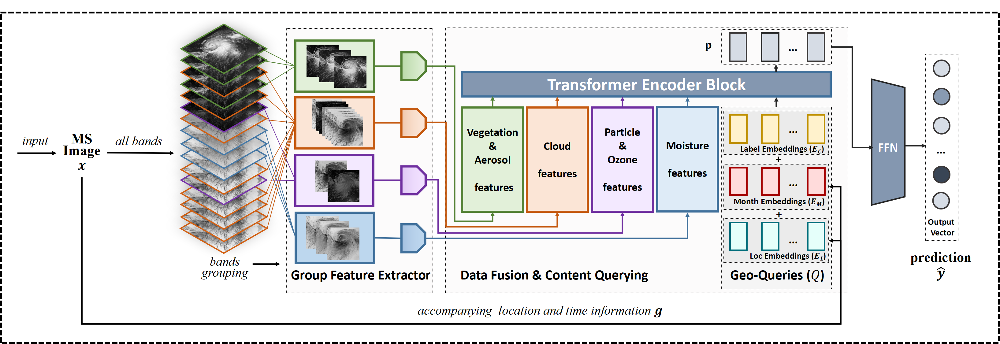

**Mine Diversified Contents of Multispectral Cloud Images Along With Geographical Information for Multilabel Classification**<br/>
Dongxiaoyuan Zhao; Qiong Wang; Jinglin Zhang; Cong Bai<br/>
IEEE Transactions on Geoscience and Remote Sensing, vol. 61, pp. 1-15, 2023, Art no. 4102415, doi: 10.1109/TGRS.2023.3270204.<br/>
[[paper]](https://ieeexplore.ieee.org/document/10108005)
<br/>

## download data ##
[[click to download LSCIDMR-V2]](https://pan.baidu.com/s/1QUNNjWp_sKiFXE5cuZvc4w?pwd=9999)

fetch code: ```9999```
## Environment Prepare ##
#### pytorch version ####
```
torchvision version: torchvision-0.11.0%2Bcu111-cp38-cp38-linux_x86_64.whl
torch version: torch-1.10.0%2Bcu111-cp38-cp38-linux_x86_64.whl
```
#### other dependencies ####
```
pip install requirements.txt
```
## inference model ##
1. dowload trained model
[[click to download trained model]](https://pan.baidu.com/s/1H_HQQZuKGk8ZXug3zVRKxA?pwd=9999)

    fetch code: ```9999```
2. move the downloaded folder```/final_model``` into ```/MS_GoGo/results```
3. run inference
    ```
    python main.py --dataset=LSCIDMR_16c\
    --model=ms_gogo\
    --backbone=cnn\
    --inference\
    --use_loc\
    --use_month\ 
   --optim=adam\
    --saved_model_name=final_model\
    --layers=2
   ```

## train new model ##
#### run training

```
python main.py --model=ms_gogo --batch_size=64 --use_month --use_loc
```
## Citing ##

```bibtex
@ARTICLE{ms_gogo,
  author={Zhao, Dongxiaoyuan and Wang, Qiong and Zhang, Jinglin and Bai, Cong},
  journal={IEEE Transactions on Geoscience and Remote Sensing}, 
  title={Mine Diversified Contents of Multispectral Cloud Images Along With Geographical Information for Multilabel Classification}, 
  year={2023},
  volume={61},
  number={},
  pages={1-15},
  doi={10.1109/TGRS.2023.3270204}
}
```
